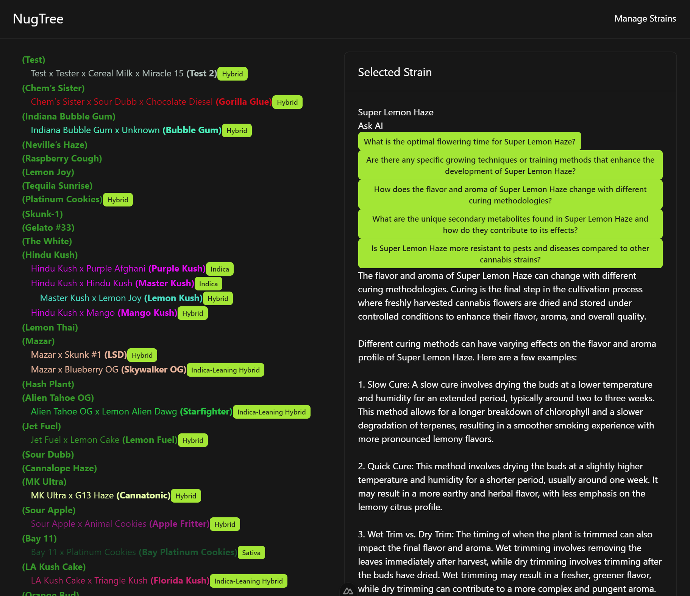

# NugTree

[](./public/nugtree.png)

Browse cannabis strains in an intuitive tree format. AI generates questions and answers about strains to help you find the perfect one.

## Setup

Make sure to install the dependencies:

```bash
npm install
```

## Development Server

Start the development server on `http://localhost:3000`:

```bash
npm run dev
npx graphql-codegen --watch
```

## Production

Build the application for production:

```bash
npm run build
```

Locally preview production build:

```bash
npm run preview
```

Check out the [deployment documentation](https://nuxt.com/docs/getting-started/deployment) for more information.
